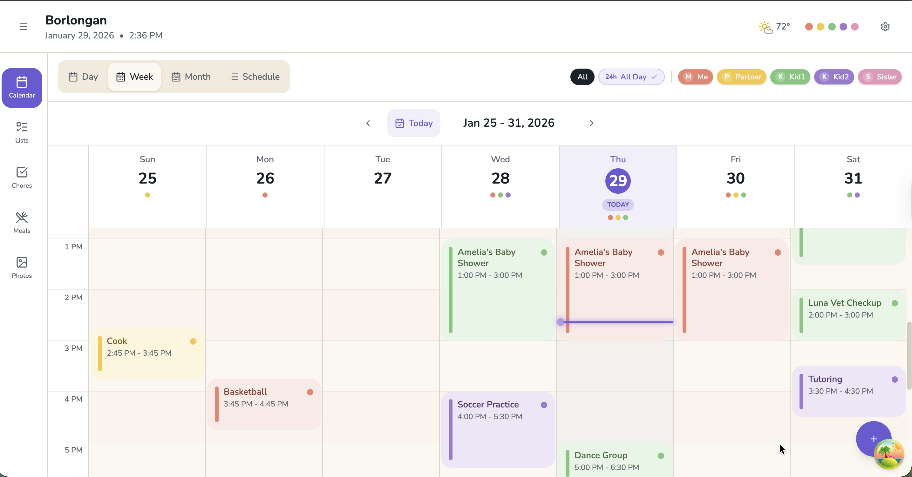
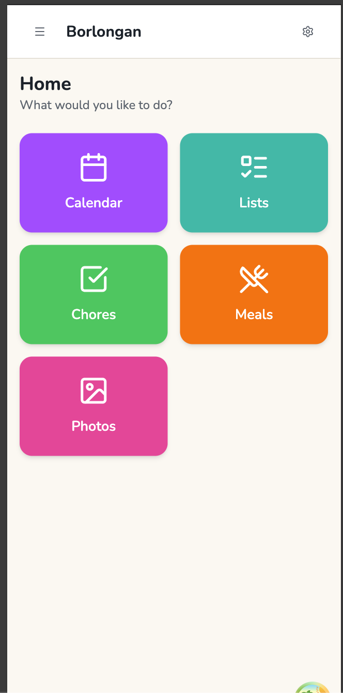

# FamilyHub

[](https://github.com/joe-bor/FamilyHub/actions/workflows/ci.yml)
[](LICENSE)

**[Live Demo](https://familyhub.joe-bor.me/)** · Try it out

<p align="center">
  
</p>

A family dashboard I'm building to organize our household — calendars, chores, meals, and more. Built with React 19 and designed for our kitchen tablet, but works great on phones too.

## What It Does

<p align="center">
  
</p>

- **Calendar** — Four views (daily, weekly, monthly, schedule list), color-coded by family member, full CRUD operations
- **Family Management** — Onboarding flow with member profiles and color assignment
- **PWA** — Installable on any device, offline support coming soon
- **More modules** — Chores, Meals, Lists, Photos (UI ready, backend coming)

## Prerequisites

- Node.js 20.19+ or 22.12+
- npm

## Quick Start

```bash
npm install
npm run dev      # localhost:5173
```

## Testing

```bash
npm test              # Unit tests (watch mode)
npm run test:e2e      # Playwright E2E tests
```

## Tech Stack

Why I chose what I chose:

- **React 19** + TypeScript + Vite — Fast dev experience, modern features
- **TanStack Query** + **Zustand** — Server state and UI state, cleanly separated
- **Tailwind CSS v4** + shadcn/ui — Beautiful, consistent styling
- **Vitest** + **Playwright** — Comprehensive testing (390+ tests)

## Current Status

**v0.3.4** — Calendar is feature-complete with mock API. Ready for backend integration. <!-- x-release-please-version -->

| Module   | Status           |
| -------- | ---------------- |
| Calendar | ✅ Complete      |
| Chores   | 🎨 UI ready      |
| Meals    | 🎨 UI ready      |
| Lists    | 🎨 UI ready      |
| Photos   | 🎨 UI ready      |

See [ROADMAP.md](docs/ROADMAP.md) for the full journey and what's next.

## Why I Built This

This is a personal project — something useful for my family and a playground for learning modern frontend patterns. The goal is a working app on our kitchen tablet.

Building is fun. Shipping is better.

## Architecture

See [CLAUDE.md](CLAUDE.md) for the deep dive on patterns, state management, testing strategies, and code conventions.

## License

[MIT](LICENSE) — do whatever you want with it.
