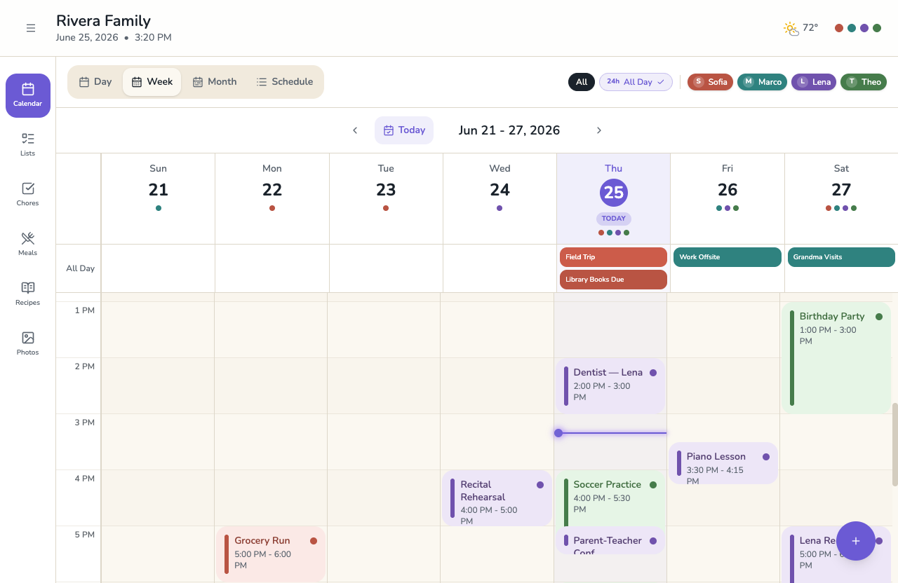
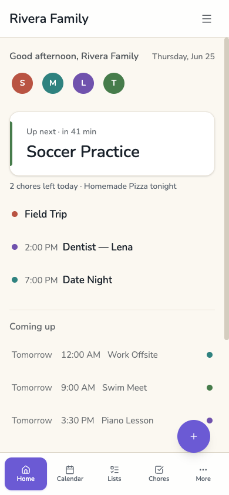
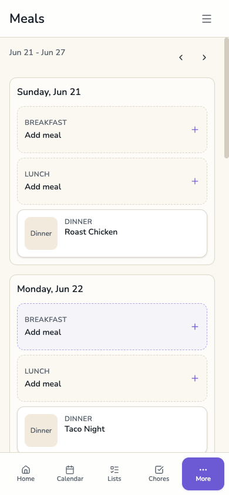
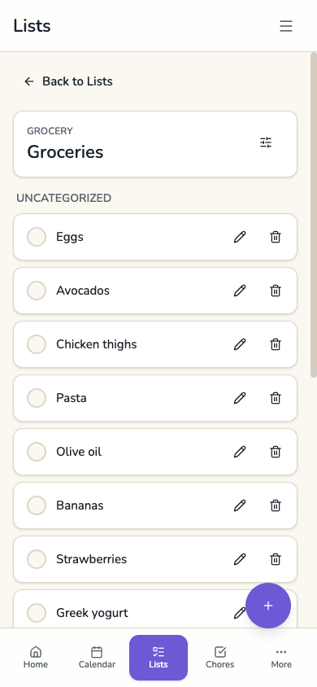
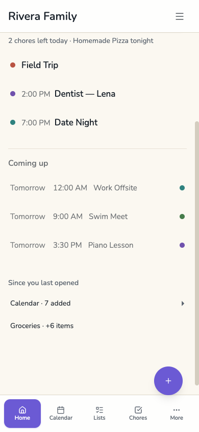
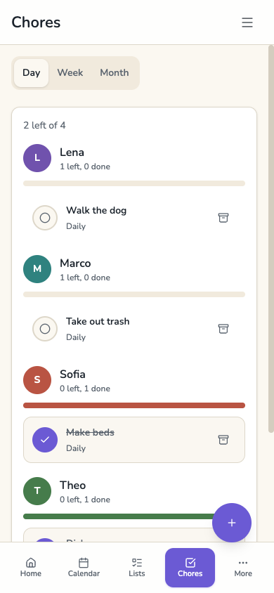

# FamilyHub

[](https://github.com/joe-bor/FamilyHub/actions/workflows/ci.yml)
[](LICENSE)

**[Live Demo](https://familyhub.joe-bor.me/)** · the family organizer running on our kitchen counter

<p align="center">
  
</p>

FamilyHub is a self-hosted family organizer — a shared **calendar, chores, meal plan, grocery lists, and recipes** in one place. It's built for an always-on kitchen tablet and polished to feel native on a phone. One shared family login, color-coded per member, no per-person accounts to juggle.

Built with React 19, designed for our household, and shipped to a $6 droplet that the whole family actually uses.

## What it does

<p align="center">
  
  
  
</p>

- **Calendar** — daily, weekly, monthly, and schedule views, color-coded by member, with recurring, all-day, and multi-day events and full CRUD.
- **Home organizer** — a calm "what's next" hero, a one-line state line (chores left + tonight's dinner), and a **"since you last opened"** feed so you can see what changed on the shared plan while you were away.
- **Chores** — daily / weekly / monthly routines per member, with completion tracking and per-person progress.
- **Lists** — shared grocery and to-do checklists.
- **Meals** — a week-at-a-glance planner across breakfast, lunch, and dinner.
- **Recipes** — a household recipe library that feeds the meal planner.
- **Photos** — UI in place; backend integration is on the roadmap.

## Native-feel mobile PWA

The home is a single tablet, but the family lives on their phones — so FamilyHub installs and behaves like a real app:

- **Installable** on any device (Add to Home Screen) with a standalone, full-screen launch.
- **Offline reads** — already-loaded calendar, chores, lists, meals, and recipes stay viewable with no connection (TanStack Query cache persisted to IndexedDB).
- **Native interactions** — hardware back-button handling, optional haptics, press feedback, and module-switch transitions.
- **Thumb-first UI** — expandable bottom sheets and a persistent bottom navigation.

<p align="center">
  
  
</p>

## Under the hood

- **React 19** + **TypeScript** + **Vite** — fast dev, modern runtime.
- **TanStack Query** (server state) + **Zustand** (UI state) — cleanly separated, with localStorage/IndexedDB write-through for instant, offline-capable startup.
- **Tailwind CSS v4** + **Radix UI** (shadcn/ui patterns) — theming via oklch CSS variables.
- **Vitest** + **Playwright** — 1,100+ unit/integration tests plus E2E that runs against the **real backend**, not mocks.
- **PWA** via `vite-plugin-pwa`; automated semver with release-please; CI builds and tests on every push.

Pairs with [`family-hub-api`](https://github.com/joe-bor/family-hub-api) — Spring Boot, Java 21, PostgreSQL — currently **v1.6.0**. See [CLAUDE.md](CLAUDE.md) for the deep dive on architecture, state management, testing strategy, and conventions.

## Getting started

**Prerequisites:** Node.js 20.19+ or 22.12+ and npm.

```bash
npm install
npm run dev      # http://localhost:5173
```

The app talks to a live `family-hub-api`. By default the Vite dev server proxies `/api/*` to `http://localhost:8080` — see [`family-hub-api`](https://github.com/joe-bor/family-hub-api) to run the backend locally.

```bash
npm test              # Vitest (watch mode)
npm run test:e2e      # Playwright E2E (needs the backend running)
npm run build         # type-check + production build
```

## Status

**v0.3.25** — Calendar, Chores, Lists, Meals, and Recipes are integrated with `family-hub-api` v1.6.0. Photos is UI-only for now. <!-- x-release-please-version -->

| Module   | Status          |
| -------- | --------------- |
| Calendar | ✅ Complete     |
| Home     | ✅ Organizer summary + activity feed |
| Chores   | ✅ Implemented  |
| Lists    | ✅ Implemented  |
| Meals    | ✅ Implemented  |
| Recipes  | ✅ Implemented  |
| Photos   | 🎨 UI ready     |

**What's next:** family-managed list categories, then event reminders and calendar gestures. The product roadmap and backlog live in the [`family-hub`](https://github.com/joe-bor/family-hub) workspace repo (`docs/product/`).

## Why I built this

This is a personal project — something genuinely useful for my family, and a playground for modern frontend patterns. The goal was simple: a calm, always-there hub on the kitchen counter that also lives in our pockets.

Building is fun. Shipping is better.

## License

[AGPL-3.0](LICENSE) — Copyright © 2026 Joezari Borlongan. FamilyHub is open source, and any fork or hosted derivative must stay open source too: if you run a modified version as a network service, you have to share your source with its users.
